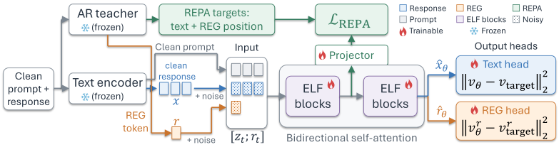
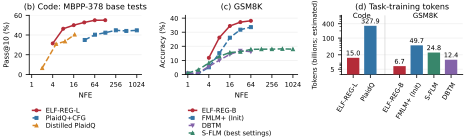
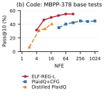
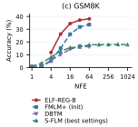
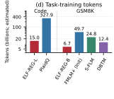
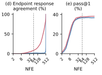

+++
title = "ELF-REG: Scaling Continuous Diffusion Language Models to Reasoning Tasks"
date = 2026-10-06
draft = false
url = "/blog/elf-reg/"
author = "Zeyu Michael Li"
description = "Learning with REPA and REG, and generating useful answers before continuous denoising is complete."
summary = "We extend ELF to mathematical reasoning and code generation with representation alignment and entanglement, then examine early-stop and clean-prediction re-noising."
+++

<p class="paper-authors"><a href="https://lizeyu090312.github.io/">Zeyu Michael Li</a><sup>1</sup>, <a href="https://www.linkedin.com/in/william-chen12">William Xingxu Chen</a><sup>1</sup>, <a href="https://scholar.google.com/citations?user=ZhSK1PEAAAAJ&amp;hl">Bingshuo Qian</a><sup>1</sup>, <a href="https://github.com/Teresa-l23">Jiayin Liu</a><sup>2</sup>, <a href="https://sites.google.com/berkeley.edu/xiangcheng/home">Xiang Cheng</a><sup>1</sup></p>
<p class="paper-affiliations"><sup>1</sup> Duke University &nbsp; <sup>2</sup> Tsinghua University</p>
<p class="paper-links"><a href="https://arxiv.org/abs/2609.29102">Paper</a><a href="https://github.com/lizeyu090312/scaling_dLM">Code</a></p>

<p class="tldr"><strong>TL;DR.</strong> We extend ELF, a fully continuous diffusion language model, to mathematical reasoning and code generation using representation alignment and entanglement (REPA+REG). We also analyse early-stop generation, which achieves strong few-step performance without dedicated few-step training.</p>





## Reasoning with continuous representations

ELF jointly denoises continuous representations for the entire response and decodes all response tokens in parallel at the end. [Block-autoregressive dLMs](https://arxiv.org/abs/2503.09573) generate successive blocks using diffusion, conditioning each block on previously generated blocks.

Our work builds on [ELF: Embedded Language Flows](https://arxiv.org/abs/2605.10938). We extend ELF to math (GSM8K, MATH-500) and coding (HumanEval, MBPP) benchmarks using [representation alignment](https://arxiv.org/abs/2410.06940) and [entanglement](https://arxiv.org/abs/2507.01467) (REPA+REG). We supervise ELF with representations from a frozen autoregressive teacher, aligning intermediate features and jointly denoising a global teacher representation with the response. We call the resulting method **ELF-REG**.

We train separate ELF baseline and ELF-REG models for GSM8K and code generation, then fine-tune their GSM8K-trained models on MATH data. Each task-specific checkpoint is evaluated across budgets measured in network function evaluations (NFE), without dedicated few-step training.

On math benchmarks, ELF-REG-L reaches 55.96% pass@1 on GSM8K at 64 NFE and 13.39% on MATH-500 at 128 NFE (paper Table 2). On MBPP-378, ELF-REG-L trained on coding data reaches 46.39% pass@10 at 8 NFE, compared with 40.49% for PlaidQ-D16 at 17 NFE (paper Table 17). ELF-REG-B also achieves strong early-stop performance on GSM8K at a smaller task-training token budget than the comparison models in Figure 1.

<figure id="figure-1">
<div class="method-scroll" tabindex="0" role="region" aria-label="Method diagram"></div>

<div class="mobile-panels">



</div>
<figcaption><strong>Paper Figure 1.</strong> (a) Representation alignment and entanglement. (b) MBPP-378 base-test pass@10 across NFE budgets. (c) GSM8K pass@1 across NFE budgets; we report mean accuracy across 16 generation seeds for ELF-REG-B. ELF-REG uses early-stop with ρ = 8. (d) Estimated non-padding task-training tokens. These budgets exclude inherited foundation pretraining and PlaidQ's unreported distillation budget. See paper Appendix B for the comparison details.</figcaption>
</figure>

## Fully continuous generation, building on ELF

Our architecture and implementation build on ELF and its [open-source PyTorch implementation](https://github.com/lillian039/ELF/tree/pytorch_elf). A frozen Qwen3-0.6B-Base encoder maps clean text to continuous representations. During training, we mix the response representations with Gaussian noise and hold the prompt fixed. A bidirectional transformer predicts the clean response representations from this corrupted input.

At inference, the response starts from noise. The denoiser uses its clean prediction to update the continuous state. ELF's self-conditioning guidance also supplies the previous clean prediction to the next evaluation. Bidirectional attention lets all response positions exchange information throughout denoising; one final evaluation of the same transformer decodes the response tokens in parallel.

At every denoising evaluation, the model predicts clean response representations. This estimate of the clean response representations is refined throughout denoising. Early-stop decodes the latest estimate before the end of the denoising trajectory, saving the remaining denoising evaluations.

## Learning with REPA and REG

We adapt [representation alignment (REPA)](https://arxiv.org/abs/2410.06940) and [entanglement (REG)](https://arxiv.org/abs/2507.01467) from image generation to ELF. A separate frozen Qwen3-1.7B-Base autoregressive teacher processes the clean prompt and response to provide training targets for representation alignment and entanglement.

**REPA** supervises intermediate denoiser features at each token position. A learned projector maps these features to the teacher's dimension, and a cosine-alignment loss increases their alignment with the teacher's clean representations at the corresponding positions. The denoiser therefore learns to recover features of clean text while its input is noisy. Its attention remains bidirectional even though the teacher is autoregressive.

**REG** adds a global representation to the denoising task. We standardize the teacher's last content-token state, corrupt it with noise, and append it as an additional REG token. This token exchanges information with the response through self-attention. The model predicts its clean state alongside the clean text representations, with REPA supervision at the REG token position as well.

The teacher and REPA projector are used only during training. At inference, both the response and the REG token start from noise and are denoised jointly. The REG token remains available to the decoder, which emits only text.



Training the model to denoise the REG token jointly with the text improves accuracy beyond REPA-only on GSM8K (paper Table 5). **Stripped REPA+REG** removes the REG token at inference while retaining the trained text-model weights. Most of this improvement remains when the REG token is removed at inference. **REPA+OLT**, which adds one learnable token to REPA, produces a smaller improvement than REPA+REG.

## Results

We train separate models for GSM8K, MATH, and code generation. For MATH, we fine-tune the corresponding GSM8K-trained models on MATH data and evaluate them on MATH-500. The code models are evaluated on HumanEval and MBPP-378. At matched NFE, ELF-REG-L improves over ELF-L baseline on all four benchmarks (paper Tables 1–2).



GSM8K pass@1 increases from 51.85% to 55.96% at 64 NFE, and MATH-500 from 10.55% to 13.39% at 128 NFE. The gains on HumanEval and MBPP-378 show that REPA+REG also improves code generation. These comparisons use the headline sampler, with a logit-normal time grid and Euler updates. Clean-prediction re-noising combined with a power time grid yields further gains with the same checkpoints.

## Early-stop: useful answers before responses stabilize

For a budget of N NFE, early-stop constructs the longer time grid for 8N NFE, runs its first N−1 denoiser evaluations, and decodes the latest clean prediction. Full-span generation uses all N−1 denoiser evaluations to traverse the full denoising interval, then decodes the final updated state. In matched-NFE GSM8K experiments, early-stop improves ELF-REG-B over full-span generation at every evaluated budget (paper Table 6).

<figure class="early-stop" id="figure-2">


<figcaption><strong>Paper Figure 2, panels (d–e).</strong> Continuing beyond the NFE-64 exit increases complete-response agreement substantially while adding little aggregate accuracy on GSM8K. We report mean complete-response agreement and mean accuracy across four generation seeds. Dashed lines mark the exit. At NFE 512, the updated endpoint agrees with itself by construction.</figcaption>
</figure>

Numerical answers often stabilize before complete responses. At NFE 64, numerical answers match those at the endpoint of the same NFE-512 trajectories in 87.11% of paired cases for ELF-REG-B on GSM8K (paper Table 11). Complete responses match in only 8.61% of cases (paper Figure 2d; Table 11). Continuing to NFE 512 changes correctness in both directions, with a net accuracy gain of 0.64 percentage points (paper Table 11), while the accuracy curve stays nearly flat after the early exit (paper Figure 2e). Many responses change after the early exit without changing the extracted answer.

The intermediate clean prediction estimates the endpoint using the current denoising velocity. If this velocity changes little over the remaining trajectory, the estimate can stay close to the endpoint. Decoding also allows some representation error: a token remains unchanged as long as its logit stays above its competitors. A larger winning margin tolerates a larger change in the representation, provided the decoder's logits do not change too sharply. The paper relates these conditions through endpoint error and decoder margins, building on [decoder-interface analysis](https://arxiv.org/abs/2606.08810).

This intuition concerns agreement with the endpoint, not correctness. Task accuracy can remain similar even when complete responses differ, as the numerical-answer comparison in paper Table 11 shows. Early-stop avoids the remaining evaluations while retaining strong aggregate accuracy in these experiments.

[Prior work](https://arxiv.org/abs/2305.10818) has also explored [early stopping in continuous language diffusion](https://aclanthology.org/2024.naacl-long.261/). We examine it here empirically for ELF diffusion language models on reasoning benchmarks, comparing intermediate clean predictions, decoded responses, and answer accuracy along the same trajectories. Additionally, we draw a theoretical connection between early-stop and flow maps (paper Section 4). 

## Sampler choice: clean-prediction re-noising

The headline sampler uses a logit-normal time grid with Euler updates. We compare it with **clean-prediction re-noising combined with a power time grid**, changing both the time schedule and the update that constructs the next noisy state without retraining the model.

A power time schedule with exponent 0.5 places more evaluations near the exit than uniform spacing, retaining the headline sampler's final prediction time. At each nonterminal evaluation, we combine the clean prediction with fresh Gaussian noise, weighted for the next timestep and using a noise multiplier of 1.2. The REG token receives the same update with independent noise; the prompt remains fixed, and the previous clean prediction still supplies self-conditioning. The final evaluation decodes the clean prediction directly.

Each update constructs a new noisy input from the current clean estimate, which the denoiser then refines. The comparison uses the same ELF-REG-L checkpoint for both samplers within each benchmark and holds NFE fixed (paper Table 4).



Clean-prediction re-noising combined with a power time grid improves pass@1 on all four math and coding benchmarks at NFE 16 and above, but performs worse at NFE 4. Its benefit therefore depends on the generation budget. We explain the clean-prediction re-noising sampler and include sampling ablations in Appendix D.1.1 of the paper.

## Toward stronger continuous language models

REPA+REG improves task-specific ELF models, and early-stop obtains strong few-step performance from those same checkpoints. Harder mathematical reasoning remains challenging: even with the improvements on MATH-500, absolute accuracy leaves substantial room for progress. Extending these results to a generalist continuous model is another open direction.

The [paper](https://arxiv.org/abs/2609.29102) contains the full experiments and analysis. The [code repository](https://github.com/lizeyu090312/scaling_dLM) provides task datasets, checkpoints, and evaluation procedures.

## BibTeX

```bibtex
@misc{li2026elfreg,
  title={ELF-REG: Scaling Continuous Diffusion Language Models to Reasoning Tasks}, 
  author={Zeyu Michael Li and William Xingxu Chen and Bingshuo Qian and Jiayin Liu and Xiang Cheng},
  year={2026},
  eprint={2609.29102},
  archivePrefix={arXiv},
  primaryClass={cs.CL},
  url={https://arxiv.org/abs/2609.29102}, 
}
```

## Acknowledgements

We thank the authors of [ELF: Embedded Language Flows](https://github.com/lillian039/ELF) for open-sourcing the architecture and PyTorch training and evaluation implementation on which this work builds. We also credit the authors of [REPA](https://arxiv.org/abs/2410.06940) and [REG](https://arxiv.org/abs/2507.01467) for the representation-supervision methods we adapt here.

We acknowledge the Duke Compute Cluster (DCC), maintained by Duke Research Computing, for providing computational resources used in this work. We also acknowledge the computational resources provided by NCShare, which is supported by National Science Foundation (NSF) grants OAC-2201525, OAC-2201105, and OAC-2430141.
